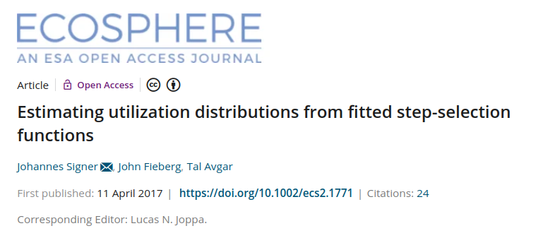
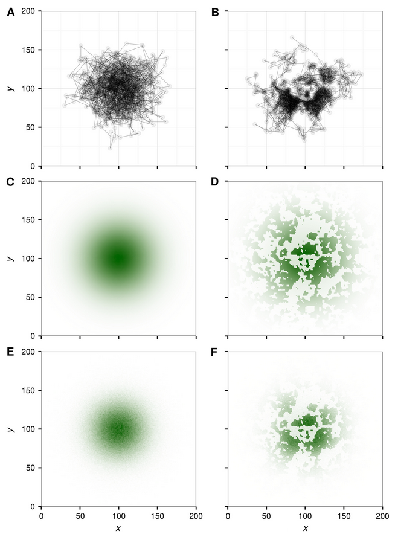
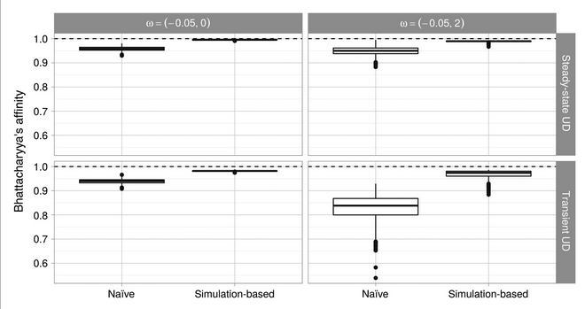
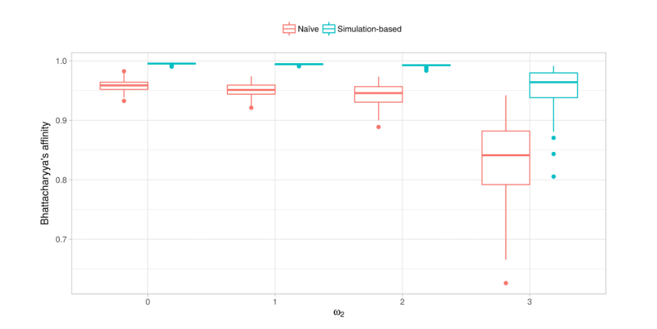
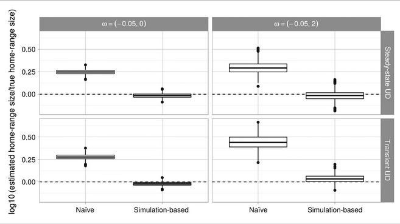

```{r setup, include=FALSE}
library(tidyverse)
library(here)
knitr::opts_knit$set(root.dir = here::here("07 Simulation"))
knitr::opts_chunk$set(
  echo = TRUE, warning = FALSE, message = FALSE, 
  fig.height = 4, fig.width = 6, cache = FALSE, out.width = "85%", res = 600,
  comment = "", fig.align = "center")
options(width = 70, str = strOptions(strict.width = "wrap"))
theme_set(theme_light()) 
```

# Why to simulate?

Different end products are available: 

1. The individual path
2. Where is the animal next?

Some times we are aiming to **Utilization Distribution** (UD). 

The UD is defined as: 

> The two-dimensional relative frequency distribution of space use of an animal (Van Winkle 1975)

---- 

We can distinguish between two different UDs:

1. Transient UD (TUD) is the expected space-use distribution over a short time period and is thus sensitive to the initial conditions (e.g., the starting point).
2. Steady state UD (SSUD) is the long-term (asymptotically infinite) expectation of the space-use distribution across the landscape.

**Think-pair-share:** Can we use a HSF/RSF to predict a possible path of the animal.


# Predicting space use from HSF

From HSF we can only estimate a SSUD. This is done by using the following formula

$$
UD(s_j) = \frac{w(s_j)}{\sum_{j = 1}^G w(s_j)} = \frac{\exp(\sum_{i = 1}^n\beta_i x_i(s_j))}{\sum_{j = 1}^G \exp(\sum_{i = 1}^n\beta_i x_i(s_j))}
$$


The intercept ($\beta_0$) is **not** included. 

----

## For iSSF this a bit more complicated


If we take the same approach for iSSFs, we introduce a **bias** because we are neglecting conditional formulation of iSSFs when creating maps.


```{r, echo = FALSE}

```

-----

- Simulations were used to compare two approaches:
    - naive
    - simulation-based

```{r, echo = FALSE, fig.cap="Source Signer et al. 2017", out.width="40%"}

```


-----

```{r, echo = FALSE, fig.cap="Source Signer et al. 2017"}

```

-----

The bias becomes even worse if selection is stronger:

```{r, echo = FALSE, fig.cap="Source Signer et al. 2017"}

```


-------

This bias propagates through derived quantities (e.g., home-range size)

```{r, echo = FALSE, fig.cap="Source Signer et al. 2017"}

```


# Take-home messages

- Simulation allow us to predict space-use in the long term, novel environment or other individuals. 
- For iSSA it is important to acknowledge the conditional formulation. 
- We can acknowledge the conditional formulation by using simulations.

-------------

\begin{itemize}
\item<1-> Simulating space use from fitted iSSFs received a lot of interest.
\item<3-> Some studies applied this already, 
\item<5-> and methods being developed.
\end{itemize}

\vfill
\centering

\includegraphics<1>[width=0.9\linewidth]{../img/signer2017.png}
\includegraphics<2>[width=0.9\linewidth]{../img/potts2020.png}
\includegraphics<3>[width=0.9\linewidth]{../img/hooker2021.png}
\includegraphics<4>[width=0.9\linewidth]{../img/whittington2022.png}
\includegraphics<5>[width=0.9\linewidth]{../img/potts2022.png}
\includegraphics<6>[width=0.9\linewidth]{../img/potts2022b.png}


# The iSSF (again)

\begin{equation*}
\only<1->{\textcolor{blue}{(\mathbf{s}, t + \Delta t)}} \only<2->{|\textcolor{blue!50}{u(\mathbf{s}', t)}} \only<3->= \frac{\only<4->{\textcolor{violet}{w(\mathbf{X}(\mathbf{s});\mathbf{\beta}(\Delta t))}}\only<5->{\textcolor{spamwell}{\phi(\theta(\mathbf{s}, \mathbf{s'}), \gamma(\Delta t))}}}
{\only<6->{\textcolor{black!40}{\underbrace{\int_{\tilde{\mathbf{s}} \in G} w(\mathbf{X}( \tilde{\mathbf{s}});\mathbf{\beta}(\Delta t))\phi(\theta(\tilde{\mathbf{s}}, \mathbf{s}');\gamma(\Delta t))d\tilde{\mathbf{s}}}_{\text{Normalizing constant}}}}}
\end{equation*}

We want to model the probability that the animals moves to position $\textcolor{blue}{\mathbf{s}}$ at time \textcolor{blue}{$t + \Delta t$}\only<2->{, given it is a position $\textcolor{blue!50}{\mathbf{s'}}$ at time $\textcolor{blue!50}{t}$.}


\only<3->{The \textbf{redistribution kernel} consists of two components:
\begin{itemize}
\item<4-> The movement-free habitat-selection function $\textcolor{violet}{w(\mathbf{X}(\mathbf{s});\mathbf{\beta}(\Delta t))}$
\item<5-> The selection-free movement kernel $\textcolor{spamwell}{\phi(\theta(\mathbf{s}, \mathbf{s'}), \gamma(\Delta t))}$
\end{itemize}
}


# The idea 

1. At a given position generate a set of possible location the animal could reach each within one time step (= selection-free movement kernel). There are two ways to generate these locations:  \pause
    - Stochastic approximation of the selection-free movement kernel (using the uncorrected tentative distributions). 
\pause
    - Generate a grid of around a the position and weight each cell according to the movement kernel (be careful we are moving from polar to euclidean coordinates here). 
2. Habitat covariates are weighted with the selection coefficients to obtain the movement-free habitat-selection function. 
\pause
3. The selection-free movement kernel and the movement-free selection-function are then multiplied and normalized.

# What is next?

- We can either work with the redistribution kernels for each relocation, or
- sample one location as the next point to move to. This could be repeated many times and we can simulate a new track from the model that we fitted.


# Case study

To illustrate the use of simulation, we fitted an iSSF to tracking data of a single African buffalo\footnotemark\textsuperscript{,}\footnotemark.

\only<2->{We fitted three different models using \texttt{amt}: }

\begin{enumerate}
\item<3-> \textbf{Base model}: \texttt{case\_ \~{} cos(ta\_) + sl\_ + log(sl\_) + water\_dist\_end}
\item<4-> \textbf{Home-range model}: \texttt{case\_ \~{} cos(ta\_) + sl\_ + log(sl\_) + water\_dist\_end + \textcolor{spamwell}{x2\_ + y2\_ + I(x2\_\^{}2 + y2\_\^{}2)}}
\item<5-> \textbf{River model}: \texttt{case\_  \~{} cos(ta\_) + sl\_ + log(sl\_) + water\_dist\_end + x2\_ + y2\_ + I(x2\_\^{}2 + y2\_\^{}2) + \textcolor{spamwell}{I(water\_crossed\_end != water\_crossed\_start)}}
\end{enumerate}

\footnotetext[1]{For details of the data see: Getz et al. 2007 LoCoH: Nonparameteric kernel methods for constructing home ranges and utilization distributions. PLoS ONE}
\footnotetext[2]{Cross et al. 2016. Data from: Nonparameteric kernel methods for constructing home ranges and utilization distributions. Movebank Data Repository. DOI:10.5441/001/1.j900f88t.}


----

\only<1>{\textbf{The setting}}
\only<2>{\textbf{The observed track}}
\only<3>{\textbf{Base model}: \texttt{case\_ \~{} cos(ta\_) + sl\_ + log(sl\_) + water\_dist\_end}}
\only<4>{\textbf{Home-range model}: \texttt{case\_ \~{} cos(ta\_) + sl\_ + log(sl\_) + water\_dist\_end + \textcolor{spamwell}{x2\_ + y2\_ + I(x2\_\^{}2 + y2\_\^{}2)}}}
\only<5>{\textbf{River model}: \texttt{case\_  \~{} cos(ta\_) + sl\_ + log(sl\_) + water\_dist\_end + x2\_ + y2\_ + I(x2\_\^{}2 + y2\_\^{}2) + \textcolor{spamwell}{I(water\_crossed\_end != water\_crossed\_start)}}}

\vfill

\includegraphics<1>[width=\linewidth]{../img/fig_2_1.png}
\includegraphics<2>[width=\linewidth]{../img/fig_2_2.png}
\includegraphics<3>[width=\linewidth]{../img/fig_2_3.png}
\includegraphics<4>[width=\linewidth]{../img/fig_2_4.png}
\includegraphics<5>[width=\linewidth]{../img/fig_2_5.png}

# Key resources/publications

\footnotesize

- Avgar, T., Potts, J. R., Lewis, M. A., & Boyce, M. S. (2016). Integrated step selection analysis: bridging the gap between resource selection and animal movement. Methods in Ecology and Evolution, 7(5), 619-630.
- Potts, J. R., & Schlägel, U. E. (2020). Parametrizing diffusion‐taxis equations from animal movement trajectories using step selection analysis. Methods in Ecology and Evolution, 11(9), 1092-1105.
- Signer, J., Fieberg, J., & Avgar, T. (2017). Estimating utilization distributions from fitted step‐selection functions. Ecosphere, 8(4), e01771.
